<picture>
  <source media="(prefers-color-scheme: dark)" srcset="assets/header-dark.svg">
  <source media="(prefers-color-scheme: light)" srcset="assets/header-light.svg">
  
</picture>

&nbsp;&nbsp;

<table align="center">
<tr><td>

**`📍`** Beijing, China &nbsp;·&nbsp; product manager in civil-aviation ATC & aviation weather — building the tools myself

**`🔭`** Air traffic management &nbsp;·&nbsp; aviation meteorology &nbsp;·&nbsp; geospatial visualization

**`📡`** ECMWF · GRIB2 · METAR / TAF · ADS-B · GeoJSON / PMTiles

**`🌐`** [aeris.edbn.me](https://aeris.edbn.me) · [greatwallarchive.com](https://greatwallarchive.com) · [aimaptools.com](https://aimaptools.com) · [svg2img.bult.dev](https://svg2img.bult.dev)

</td></tr>
</table>

<!-- LIVE-SKY:BEGIN metar/wind workflow 首跑成功后解除本注释

### ⚡ Live from the sky

<picture>
  <source media="(prefers-color-scheme: dark)" srcset="https://raw.githubusercontent.com/qiaoqiaobby/qiaoqiaobby/output/metar-zbaa-dark.svg">
  <source media="(prefers-color-scheme: light)" srcset="https://raw.githubusercontent.com/qiaoqiaobby/qiaoqiaobby/output/metar-zbaa-light.svg">
  
</picture>

<picture>
  <source media="(prefers-color-scheme: dark)" srcset="https://raw.githubusercontent.com/qiaoqiaobby/qiaoqiaobby/output/wind-beijing-dark.svg">
  <source media="(prefers-color-scheme: light)" srcset="https://raw.githubusercontent.com/qiaoqiaobby/qiaoqiaobby/output/wind-beijing-light.svg">
  
</picture>

Rendered to SVG by <a href="scripts">scripts/</a> on GitHub Actions, no external image services. METAR: aviationweather.gov, hourly · Forecast: ECMWF IFS via <a href="https://open-meteo.com">Open-Meteo</a> (CC-BY 4.0), daily.

LIVE-SKY:END -->

---

### ✈️ Featured Work

<table>
<tr>
<td width="50%" valign="top">

#### Aeris — Real-time 3D Flight Tracking
[**Live → aeris.edbn.me**](https://aeris.edbn.me) · private codebase

Live ADS-B traffic rendered flight-sim style on a 3D globe — frontend, data platform and an edge API gateway.

`React 19` · `deck.gl 9` · `Supabase` · `FastAPI`

</td>
<td width="50%" valign="top">

#### Great Wall Heritage Archive
[**Live → greatwallarchive.com**](https://greatwallarchive.com) · private codebase

43,809 heritage records — crawler to GeoJSON/PMTiles pipeline to a cinematic web archive, plus a native iOS app with offline maps.

`Swift` · `MapLibre GL` · `PMTiles` · `Python`

</td>
</tr>
<tr>
<td width="50%" valign="top">

#### Aviation Weather & ATC Suite
private codebase · no public demo

METAR / TAF / SPECI assessment engine (~440 unit tests), an aviation-weather map platform, and arrival flow management with weather-aware flight-time prediction.

`TypeScript` · `Cloudflare Workers` · `MapLibre GL`

</td>
<td width="50%" valign="top">

#### AiMapTools
[**Live → aimaptools.com**](https://aimaptools.com) · private codebase

A curated navigator for GIS and mapping tools — GitHub as CMS, zero database.

`Next.js 14` · `TypeScript` · `Tailwind`

</td>
</tr>
</table>

### Open Source

| | Project | Description |
|:---:|:--------|:------------|
| 🌤️ | **[ECMWF-OpenDataOnAWS](https://github.com/qiaoqiaobby/ECMWF-OpenDataOnAWS)** | ECMWF open-data discovery & extraction across AWS / ECMWF / Azure / Google mirrors, with aviation-station tooling |
| 🖼️ | **[svg2img](https://github.com/qiaoqiaobby/svg2img)** | SVG → PNG / JPG / WebP — instant, private, entirely in the browser |
| ✈️ | **[JetPhotos-New-Tab](https://github.com/qiaoqiaobby/JetPhotos-New-Tab)** | Aviation photography in every new browser tab — zero-dependency Chrome extension |

---

### 🛠 Tech Stack

---

### 📈 Analytics

<!-- CONTRIB-3D:BEGIN contrib-3d workflow 首跑成功后解除本注释
<picture>
  <source media="(prefers-color-scheme: dark)" srcset="https://raw.githubusercontent.com/qiaoqiaobby/qiaoqiaobby/output/contrib-3d-dark.svg">
  <source media="(prefers-color-scheme: light)" srcset="https://raw.githubusercontent.com/qiaoqiaobby/qiaoqiaobby/output/contrib-3d-light.svg">
  
</picture>
  
CONTRIB-3D:END -->

 

  

<picture>
  <source media="(prefers-color-scheme: dark)" srcset="https://raw.githubusercontent.com/qiaoqiaobby/qiaoqiaobby/output/github-contribution-grid-snake-dark.svg" />
  <source media="(prefers-color-scheme: light)" srcset="https://raw.githubusercontent.com/qiaoqiaobby/qiaoqiaobby/output/github-contribution-grid-snake.svg" />
  
</picture>

Most of my work lives in private repositories — public stats are the tip of the iceberg.

 

  <i>"Every pixel of weather data tells a story — I build the interfaces that let you read it."</i>

